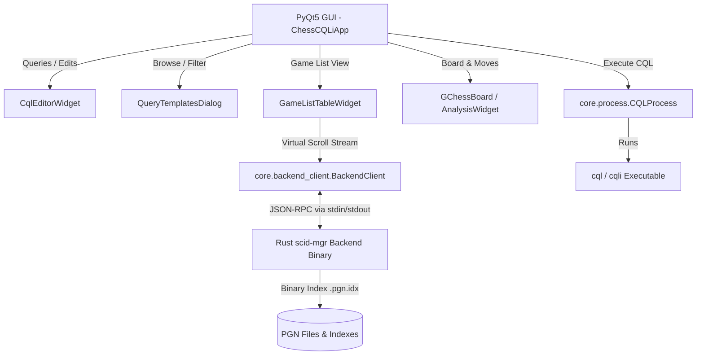

# Chess CQLi Query Tool

A modern, fast, and feature-rich desktop application built with PyQt5 for querying, managing, and exploring PGN files using **CQL / CQLi** (Chess Query Language - version 6).

Powered by the high-performance **`scid-mgr`** Rust engine for zero-copy companion binary indexing, virtual scrolling, and sub-millisecond game loading.

---

## 🚀 Key Features

- **Advanced CQLi Querying:** Execute powerful CQL/CQLi scripts against large PGN databases with multi-threaded execution and live output streaming.
- **Ultra-Fast Rust Backend (`scid-mgr`):**
  - Instant `.pgn.idx` companion binary indexing.
  - Sub-millisecond game retrieval and metadata lookups via asynchronous JSON-RPC IPC.
  - Smooth virtual table scrolling capable of handling millions of games with constant-time memory footprint.
- **Themed CQL Query & Motif Templates Explorer:**
  - Over **300 curated CQL queries** categorized across endgames, checkmating patterns, geometric tactical motifs, and FCE frequency tables.
  - Tree-based category navigation, real-time keyword search, and live syntax-highlighted CQL preview pane.
  - Ability to create, edit, overwrite, and delete custom user query templates.
- **Integrated Chessboard & Analysis:**
  - Interactive chessboard with move lists, variations navigation, and full game playback.
  - Drag-and-drop Board Editor with FEN generation, castling toggles, and position flipping.
  - UCI Chess Engine integration (e.g., Stockfish) with real-time evaluation bars and line analysis.
- **Modern & Customizable UI:**
  - Dark Mode and Light Mode support with custom styling.
  - Dockable panels for CQL Script Editor, Query Results, Log Output, and Engine Analysis.
  - Configurable game list columns and view state persistence.

---

## 🏗️ Architecture



### Module Overview

- [`main.py`](file:///C:/Users/ASUS/programming/qt_programs/chess/cqli/main.py): Main application window orchestrating docks, menus, toolbars, and layout state.
- [`core/backend_client.py`](file:///C:/Users/ASUS/programming/qt_programs/chess/cqli/core/backend_client.py): Asynchronous JSON-RPC subprocess client communicating with `scid-mgr`.
- [`core/indexer.py`](file:///C:/Users/ASUS/programming/qt_programs/chess/cqli/core/indexer.py): High-speed companion indexer invoking `scid-mgr` in CLI mode.
- [`core/process.py`](file:///C:/Users/ASUS/programming/qt_programs/chess/cqli/core/process.py): Process manager for executing CQL scripts against PGN files.
- [`widgets/game_list_table.py`](file:///C:/Users/ASUS/programming/qt_programs/chess/cqli/widgets/game_list_table.py): Asynchronously streamed virtual `QAbstractTableModel` with LRU caching.
- [`dialogs/query_templates_dialog.py`](file:///C:/Users/ASUS/programming/qt_programs/chess/cqli/dialogs/query_templates_dialog.py): Categorized CQL query explorer with tree browser, search filter, and syntax-highlighted editor.
- [`scid-mgr/`](file:///C:/Users/ASUS/programming/qt_programs/chess/cqli/scid-mgr): Rust companion submodule for high-performance PGN/SCID indexing, positional hashing, and interactive streaming.

---

## 🛠️ Setup & Installation

### 1. Requirements

- **Python 3.8+**
- **Rust toolchain (Cargo)** (to compile `scid-mgr`)
- Python packages:
  ```bash
  pip install -r requirements.txt
  ```

### 2. Building the Rust Backend (`scid-mgr`)

Compile the `scid-mgr` submodule in release mode:

```bash
cd scid-mgr
cargo build --release
cd ..
```

The compiled binary will be automatically discovered at `scid-mgr/target/release/scid-mgr.exe` (or `scid-mgr/target/release/scid-mgr` on Linux/macOS).

### 3. CQL Executable

Ensure that `cql` or `cqli` (CQL 6.x) is available in your system `PATH`, or configure its location in the application settings.

---

## 🎮 Running the Application

Launch the application with:

```bash
python main.py
```

---

## 🙏 Special Thanks & Credits

- **[elma16/reti](https://github.com/elma16/reti)**: A huge thank you to **@elma16** and the **reti** project for their comprehensive, high-quality collection of Chess Query Language scripts, FCE frequency table definitions, and endgame motif classifications. These curated scripts power the themed queries library in this application.
- **[scid-mgr](https://github.com/alexanderortizcuellar/scid-mgr)**: High-speed chess database indexing and interactive streaming engine.
- **CQL (Chess Query Language)**: Created by Gady Costeff and Lewis Stiller.
